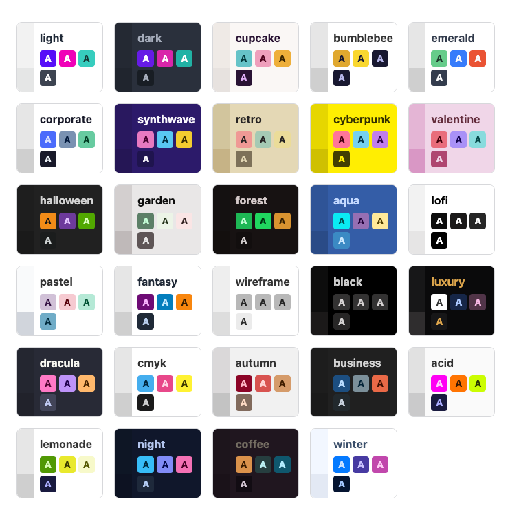

# Getting Started with the NFT Mint Starter

In this guide, we'll walk you through the steps needed to set up and run the project on your local machine. The process includes installing dependencies, configuring environment variables, and running the development server. Let's dive in!

## Installing Dependencies

This project relies on [Yarn](https://yarnpkg.com/) as its package manager. If you haven't already installed Yarn, you'll need to do so before proceeding. To install Yarn globally, execute the following command:

```bash
npm install --global yarn
```

Once Yarn is installed, navigate to the project directory and run the following command to install all necessary dependencies:

```bash
yarn
```

## Configuring Environment Variables

Next, we need to create a `.env` file to store our environment variables. This file should be created by copying the `.env.example` file provided in the project directory. Run the following command to create the `.env` file:

```bash
cp .env.example .env
```

Now, let's customize the `.env` file to suit your project's needs.

### `NEXT_PUBLIC_THEME`

This variable sets the theme for your site. You can choose from the available themes displayed in the image below:



### `NEXT_PUBLIC_CONTRACT_ADDRESS`

This variable should store the smart contract address for your project.

### `NEXT_PUBLIC_BLOCKCHAIN`

This variable specifies the blockchain network used by your project (e.g., Ethereum, Binance Smart Chain, etc.).

### `NEXT_PUBLIC_ERC_STANDARD`

This variable defines the ERC standard your project uses. It can be set to either `erc1155` or `erc721`.

### `NEXT_PUBLIC_ERC1155_TOKEN_ID`

If your project uses the `erc1155` standard, this variable should store the token ID for your ERC-1155 token.

After configuring the environment variables, save the `.env` file.

## Summary of Environment Variables

Here's a summary of the environment variables we've configured:

- `NEXT_PUBLIC_CONTRACT_ADDRESS`
- `NEXT_PUBLIC_BLOCKCHAIN`
- `NEXT_PUBLIC_THEME` (default: cupcake)
- `NEXT_PUBLIC_ERC_STANDARD` (default: erc1155)
- `NEXT_PUBLIC_ERC1155_TOKEN_ID` (default: 1)

## Running the Development Server

With dependencies installed and environment variables set, you can now start the development server by running the following command:

```bash
yarn dev
```

Open your browser and navigate to [http://localhost:3000](http://localhost:3000) to view the site.

As you make changes to the project, the page will auto-update. You can start editing the page by modifying the `pages/index.tsx` file.

## Deploying on Vercel

The most straightforward way to deploy your application is by using the [Vercel Platform](https://vercel.com/new), created by the team behind Next.js.

For more information on deploying Next.js applications, consult the [Next.js deployment documentation](https://nextjs.org/docs/deployment).
